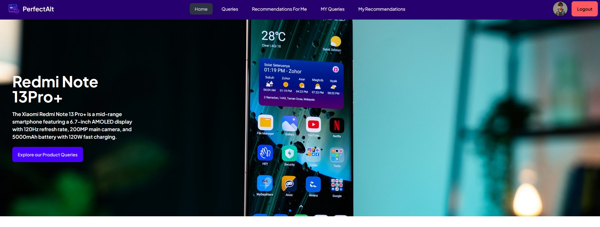

# 🚀 **PerfectAlt**  

**Live Site URL:**  
[🔗 PerfectAlt](https://product-recommendation-s-d6b6d.web.app/)

## 📞 **Contact Information**  
📱 **Phone Number:** +8801689819951  

---

## 📌 **Project Overview**  
**PerfectAlt** is a full-stack **Product Recommendation Platform** that enables users to:  

✔️ **Add, manage, and view product queries and recommendations**  
✔️ **Securely authenticate with Firebase (Google/GitHub login)**  
✔️ **Ensure protected access using JWT authentication**  
✔️ **Experience a fully responsive UI with engaging animations**  

  

---

## 📚 **Table of Contents**  
- [Technology Stack](#-technology-stack)  
- [Features](#-features)  
- [Installation](#-installation)  
- [Dependencies](#-dependencies)  
- [NPM Packages Used](#-npm-packages-used)  
- [Design Inspiration](#-design-inspiration)  

---

## 🛠 **Technology Stack**  

### **Frontend (Client-Side)**  
- ⚛️ **React.js** – Component-based frontend framework  
- 🎨 **Tailwind CSS** – Styling and responsive design  

### **Backend (Server-Side)**  
- ⚡ **Node.js** – JavaScript runtime for the server  
- 🌐 **Express.js** – Web framework for building APIs  
- 🗄 **MongoDB** – NoSQL database for data storage  

### **Authentication & Security**  
- 🔑 **Firebase Authentication** – Secure login via Google/GitHub  
- 🔒 **JWT & Middleware** – Ensuring protected API access  

---

## ✨ **Features**  

### 🔐 **Authentication**  
✔️ Email/Password login  
✔️ Google Sign-in  
✔️ JWT-based private route protection  

### 📝 **Queries**  
✔️ Add, view, update, and delete queries  
✔️ Search functionality based on product names  

### 📢 **Recommendations**  
✔️ Add, view, and delete recommendations  
✔️ Dynamic recommendation count updates  

### 📱 **Responsive Design**  
✔️ Fully responsive across **mobile, tablet, and desktop**  

### 🚀 **Navigation**  
✔️ Conditional Navbar rendering based on authentication  

### 🔍 **Additional Features**  
✔️ **404 Error Page** – Redirects users to the homepage  
✔️ **Recent Queries Section** – Interactive slider for latest queries  
✔️ **Animations** – Enhanced UI with creative homepage sections  

---

## 🛠 **Installation**  

### **Clone the repository**  
```bash
git clone https://github.com/your-username/your-repo.git
cd your-repo
```

### **Install dependencies**  
```bash
npm install
```

### **Start the development server**  
```bash
npm run dev
```

---

## 📦 **Dependencies**  

### **Main Dependencies**  
```json
{
  "axios": "^1.7.9",
  "firebase": "^11.1.0",
  "localforage": "^1.10.0",
  "lottie-react": "^2.4.0",
  "match-sorter": "^8.0.0",
  "motion": "^11.15.0",
  "react": "^18.3.1",
  "react-dom": "^18.3.1",
  "react-icons": "^5.4.0",
  "react-router-dom": "^7.1.0",
  "react-tooltip": "^5.28.0",
  "sort-by": "^1.2.0",
  "sweetalert2": "^11.15.3",
  "swiper": "^11.1.15"
}
```

### **Development Dependencies**  
```json
{
  "@eslint/js": "^9.17.0",
  "@types/react": "^18.3.17",
  "@types/react-dom": "^18.3.5",
  "@vitejs/plugin-react": "^4.3.4",
  "autoprefixer": "^10.4.20",
  "daisyui": "^4.12.22",
  "eslint": "^9.17.0",
  "eslint-plugin-react": "^7.37.2",
  "eslint-plugin-react-hooks": "^5.0.0",
  "eslint-plugin-react-refresh": "^0.4.16",
  "globals": "^15.13.0",
  "postcss": "^8.4.49",
  "tailwindcss": "^3.4.17",
  "vite": "^6.0.3"
}
```

---

## 📦 **NPM Packages Used**  

### **Frontend**  
✔️ `react` – Component-based user interface development  
✔️ `react-router-dom` – Routing and navigation  
✔️ `react-icons` – Icon library  
✔️ `axios` – HTTP requests to the server  
✔️ `lottie-react` – For animated sections  
✔️ `react-tooltip` – Tooltip functionalities  

### **Backend**  
✔️ `express` – Web server framework  
✔️ `mongoose` – MongoDB object modeling  
✔️ `dotenv` – Environment variable management  
✔️ `jsonwebtoken` – JWT token creation and validation  
✔️ `cors` – Enable CORS policies  

---

## 🎨 **Design Inspiration**  

- [Themeforest Templates](https://themeforest.net/search/questions%20and%20answers%20template)  

---
